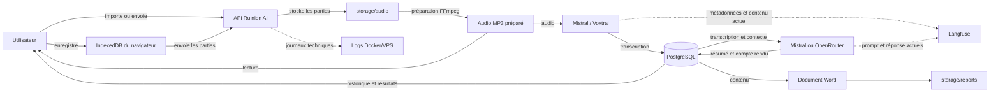

# Confidentialité V1 — Cartographie des données et matrice des permissions

**Statut :** proposition à valider avant toute modification des autorisations  
**Périmètre :** application utilisateur, administration de la plateforme, traitement IA, stockage et observabilité

## 1. Objectif

Ce document définit :

1. les données manipulées par Ruinion AI ;
2. leur parcours dans l’application ;
3. les endroits où elles sont conservées ou transmises ;
4. les personnes et services qui peuvent actuellement y accéder ;
5. les permissions cibles de la V1 confidentielle.

La règle principale proposée est la suivante :

> L’appartenance à une organisation ne donne pas automatiquement accès au contenu de toutes ses réunions.

Le contenu d’une réunion sera réservé à son créateur et aux membres explicitement invités. Les administrateurs de l’organisation et les Super Admins de la plateforme pourront gérer des métadonnées sans consulter le contenu.

## 2. Rôles utilisés dans la matrice

### Super Admin de la plateforme

Il administre Ruinion AI, les comptes, les organisations, les services et les incidents techniques. Il n’a pas besoin du contenu des réunions pour accomplir ces tâches.

### Propriétaire de l’organisation

Il gère l’organisation, ses paramètres, ses membres et ses règles générales. Son rôle ne lui donne pas automatiquement accès au contenu d’une réunion à laquelle il ne participe pas.

### Administrateur de l’organisation

Il gère les membres et les invitations dans les limites définies par le propriétaire. Son rôle ne lui donne pas automatiquement accès aux réunions des autres membres.

### Créateur de la réunion

Il crée la réunion, choisit les invités, fournit l’audio et contrôle le cycle de vie de la réunion.

### Membre invité à la réunion

Il peut consulter le contenu partagé dans cette réunion tant que son accès à l’organisation et à la réunion est actif.

### Autre membre de la même organisation

Il appartient à l’organisation, mais n’a pas créé la réunion et n’y a pas été invité.

### Services techniques

Ce groupe comprend le worker Ruinion AI, Mistral/Voxtral, les modèles de rédaction Mistral ou OpenRouter et Langfuse.

## 3. Inventaire des données

| Catégorie | Exemples | Emplacement actuel | Destinataire éventuel | Conservation actuelle |
|---|---|---|---|---|
| Identité | prénom, nom, e-mail, état du compte | PostgreSQL, table `users` | Ruinion AI | sans expiration automatique |
| Authentification | empreinte du mot de passe, jeton JWT | PostgreSQL et stockage du navigateur | Ruinion AI | compte : sans expiration automatique ; JWT : selon sa durée |
| Organisation | nom, description, règles d’invitation | PostgreSQL | membres autorisés, Super Admin | sans expiration automatique |
| Adhésion | rôle, statut, organisation, date d’ajout | PostgreSQL | organisation, Super Admin | sans expiration automatique |
| Invitation d’équipe | e-mail, rôle, statut, expiration, empreinte du jeton | PostgreSQL | propriétaire/administrateur et destinataire | sans nettoyage automatique identifié |
| Notification | titre, message, destinataire, réunion liée | PostgreSQL | utilisateur concerné | sans expiration automatique identifiée |
| Métadonnées de réunion | identifiant, date, durée, statut, modèle, coût futur | PostgreSQL | utilisateurs autorisés, administration technique | sans expiration automatique |
| Titre de réunion | sujet libre choisi par l’utilisateur | PostgreSQL | actuellement tous les membres de l’organisation et le Super Admin | sans expiration automatique |
| Participants | noms et liens vers les membres invités | PostgreSQL | actuellement tous les membres de l’organisation et le Super Admin | sans expiration automatique |
| Audio source | parties envoyées par le navigateur | disque `storage/audio` | worker Ruinion AI | sans expiration automatique |
| Audio préparé | fichier MP3 assemblé | disque `storage/audio` | utilisateur, worker, Super Admin actuellement | sans expiration automatique |
| Transcription | texte complet et segments horodatés | PostgreSQL | Mistral, modèle de rédaction, Langfuse actuellement | sans expiration automatique |
| Résultats IA | résumé court et compte rendu détaillé | PostgreSQL | utilisateur, Langfuse actuellement | sans expiration automatique |
| Document Word | compte rendu final | disque `storage/reports` | utilisateur, Super Admin actuellement | sans expiration automatique |
| Traces IA | prompt, réponse, modèle, durée, coût, erreur | Langfuse | équipe technique | contenu complet actuellement présent dans certaines traces |
| Journaux serveur | réunion, étape, modèle, erreur | sortie Docker | équipe technique/hébergeur | dépend de la configuration Docker/VPS |
| Brouillon audio | parties non encore envoyées | IndexedDB du navigateur | utilisateur sur son appareil | jusqu’à envoi, suppression ou nettoyage du navigateur |
| Sauvegardes | copie possible de PostgreSQL et de `storage` | VPS ou service de sauvegarde | administrateur infrastructure | politique à définir |

## 4. Parcours actuel d’une réunion



## 5. Emplacements techniques actuels

### Base PostgreSQL

La table `meetings` contient actuellement :

- le titre ;
- le texte des participants ;
- la transcription complète ;
- les segments horodatés ;
- le résumé court ;
- le compte rendu détaillé ;
- les chemins de l’audio et du Word ;
- la durée ;
- l’état et les erreurs du traitement ;
- l’utilisateur créateur et l’organisation.

La table `meeting_participants` relie déjà une réunion aux membres invités. Elle pourra servir à contrôler les accès sans créer une nouvelle table pour la V1.

### Stockage audio

Les fichiers sont placés sous la forme :

```text
storage/audio/org-{organisation}/meeting-{réunion}/{identifiant}/part-{numéro}
storage/audio/org-{organisation}/meeting-{réunion}/{identifiant}/recording.mp3
```

Dans Docker, le dossier local `./storage` est monté dans `/app/storage`.

### Documents Word

Les documents sont enregistrés dans `storage/reports`. La base conserve leur chemin dans `meetings.report_path`.

### Navigateur

Le jeton de connexion est conservé dans `localStorage` si l’utilisateur choisit une connexion persistante, sinon dans `sessionStorage`. Les brouillons audio utilisent IndexedDB.

### Fournisseurs IA

- Mistral/Voxtral reçoit l’audio nécessaire à la transcription.
- Le modèle de rédaction Mistral ou OpenRouter reçoit actuellement la transcription et le contexte de la réunion.
- Langfuse reçoit actuellement une partie du contenu en plus des métriques techniques.

## 6. Situation actuelle des permissions de réunion

L’accès utilisateur est actuellement vérifié avec deux informations :

```text
identifiant de la réunion
ET organisation active de l’utilisateur
```

La conséquence est qu’un membre actif peut consulter les réunions de son organisation même s’il ne les a pas créées et n’y a pas été invité.

Le Super Admin dispose actuellement de routes permettant de :

- consulter la transcription ;
- consulter les résumés ;
- voir les participants ;
- écouter l’audio ;
- télécharger le Word ;
- modifier ou supprimer une réunion ;
- relancer son traitement.

Ces permissions ne correspondent pas à la cible confidentielle définie dans ce document.

## 7. Classification des données

### Niveau 1 — Données de contenu confidentielles

- audio ;
- transcription ;
- segments horodatés ;
- résumé ;
- compte rendu ;
- document Word ;
- prompts et réponses IA ;
- liste nominative des participants ;
- titre libre de la réunion.

### Niveau 2 — Métadonnées personnelles

- identité du créateur ;
- organisation ;
- date et heure ;
- durée de la réunion ;
- membres invités ;
- notifications liées à la réunion.

### Niveau 3 — Métadonnées techniques

- identifiant opaque de la réunion ;
- étape du traitement ;
- modèle et fournisseur ;
- latence ;
- nombre de tentatives ;
- consommation et coût ;
- présence ou absence d’un fichier ;
- catégorie d’erreur nettoyée ;
- date prévue ou effective de suppression.

Le Super Admin et Langfuse doivent être limités au niveau 3. Le nom de l’organisation peut être visible dans l’administration, mais ne doit pas être transmis aux fournisseurs IA ou à Langfuse lorsque ce n’est pas nécessaire.

## 8. Matrice cible — Consultation des données

Légende :

- **Oui** : accès normal ;
- **Métadonnées** : accès aux informations techniques uniquement ;
- **Temporaire** : accès limité au temps du traitement ;
- **Exception** : accès de support explicite, limité, justifié et audité ;
- **Non** : accès interdit.

| Donnée | Créateur | Invité | Propriétaire non invité | Admin non invité | Autre membre | Super Admin | Worker IA | Fournisseur IA | Langfuse |
|---|---:|---:|---:|---:|---:|---:|---:|---:|---:|
| Identifiant technique | Oui | Oui | Métadonnées | Métadonnées | Non | Métadonnées | Oui | pseudonyme | pseudonyme |
| Titre réel | Oui | Oui | Non | Non | Non | Non | Temporaire si nécessaire | Non par défaut | Non |
| Date et durée | Oui | Oui | Métadonnées | Métadonnées | Non | Métadonnées | Oui | durée utile uniquement | Oui |
| Créateur nominatif | Oui | Oui | Métadonnées | Métadonnées | Non | compte uniquement | Non nécessaire | Non | Non |
| Participants nominatifs | Oui | Oui | Non | Non | Non | Non | Non nécessaire | Non | Non |
| Audio | Oui | Oui | Non | Non | Non | Non | Temporaire | Temporaire pour transcription | Non |
| Transcription | Oui | Oui | Non | Non | Non | Non | Temporaire | Temporaire pour rédaction | Non |
| Résumé | Oui | Oui | Non | Non | Non | Non | Temporaire | Temporaire pour génération | Non |
| Compte rendu | Oui | Oui | Non | Non | Non | Non | Temporaire | Temporaire pour génération | Non |
| Document Word | Oui | Oui | Non | Non | Non | Non | création uniquement | Non | Non |
| État du traitement | Oui | Oui | Métadonnées | Métadonnées | Non | Métadonnées | Oui | appel concerné | Oui |
| Coût et latence | Oui, si affiché | Non nécessaire | agrégés | agrégés | Non | Métadonnées | Oui | valeur propre | Oui |
| Erreur utilisateur simplifiée | Oui | Oui | Métadonnées | Métadonnées | Non | Métadonnées | Oui | valeur propre | catégorie seulement |
| Erreur brute fournisseur | Non | Non | Non | Non | Non | Exception | Oui | valeur propre | nettoyée |

## 9. Matrice cible — Actions

| Action | Créateur | Invité | Propriétaire non participant | Admin non participant | Autre membre | Super Admin |
|---|---:|---:|---:|---:|---:|---:|
| Créer une réunion | Oui | Oui pour sa réunion | Oui | Oui | Oui | Non |
| Choisir les invités | Oui | Non | Non | Non | Non | Non |
| Envoyer ou enregistrer l’audio | Oui | Non en V1 | Non | Non | Non | Non |
| Lancer ou relancer le traitement | Oui | Non en V1 | Non | Non | Non | Exception sans lecture du contenu |
| Consulter le contenu | Oui | Oui | Non | Non | Non | Non |
| Écouter l’audio | Oui | Oui | Non | Non | Non | Non |
| Copier la transcription | Oui | Oui | Non | Non | Non | Non |
| Télécharger l’audio | Oui | Oui en V1 | Non | Non | Non | Non |
| Télécharger le Word | Oui | Oui en V1 | Non | Non | Non | Non |
| Modifier la conservation | Oui | Non | règle maximale de l’organisation | Non | Non | Non |
| Supprimer seulement l’audio | Oui | Non | application forcée de la politique, sans lecture | Non | Non | Non |
| Supprimer la réunion complète | Oui | Non | suppression administrative auditée | Non | Non | Non |
| Voir l’audit de la réunion | Oui | accès propre | Oui sans contenu | selon délégation | Non | métadonnées seulement |
| Gérer les membres de l’organisation | Non lié | Non lié | Oui | selon les règles | Non | gestion de compte exceptionnelle |

## 10. Règle d’autorisation cible pour une réunion

La lecture du contenu devra être accordée si et seulement si :

```text
l’utilisateur possède une adhésion active à l’organisation
ET
(
    il est le créateur de la réunion
    OU
    son adhésion figure dans meeting_participants
)
```

Le même contrôle devra être appliqué à toutes les routes de contenu :

- détail de la réunion ;
- liste et recherche ;
- audio ;
- transcription ;
- résumé et compte rendu ;
- document Word ;
- relance ;
- suppression ;
- futurs exports.

Pour éviter de révéler l’existence d’une réunion, une personne non autorisée recevra une réponse équivalente à « réunion introuvable ».

## 11. Accès de support exceptionnel proposé

La V1 peut fonctionner sans permettre au support de lire le contenu. Si un accès exceptionnel devient nécessaire plus tard, il devra respecter toutes les conditions suivantes :

1. demande explicite du créateur ou du propriétaire de l’organisation ;
2. motif obligatoire ;
3. périmètre limité à une réunion ;
4. durée courte et date d’expiration ;
5. authentification renforcée du technicien ;
6. journalisation de chaque consultation ou téléchargement ;
7. notification visible par l’organisation ;
8. révocation immédiate possible.

Ce mécanisme n’est pas requis pour retirer dès maintenant l’accès normal du Super Admin.

## 12. Données à conserver dans Langfuse

Langfuse devra recevoir uniquement :

- un identifiant de trace non parlant ;
- un identifiant de réunion pseudonymisé ;
- l’étape du pipeline ;
- le modèle et le fournisseur ;
- la latence ;
- les tokens ou secondes facturés ;
- le coût ;
- le nombre de tentatives ;
- le statut ;
- une catégorie d’erreur nettoyée ;
- la taille du texte en caractères, sans le texte lui-même.

Langfuse ne devra plus recevoir :

- l’audio ;
- la transcription ;
- le prompt complet ;
- la réponse du modèle ;
- le résumé ;
- le compte rendu ;
- le titre ;
- le nom de l’organisation ;
- le nom ou l’e-mail d’un utilisateur ;
- les participants ;
- un chemin de fichier interne.

## 13. Données minimales envoyées aux fournisseurs IA

### Transcription

Mistral/Voxtral reçoit :

- le fichier audio préparé ;
- le modèle demandé ;
- les paramètres nécessaires aux horodatages.

Il ne doit pas recevoir le nom de l’organisation, l’identité des utilisateurs ou le titre de la réunion.

### Rédaction

Le modèle de rédaction reçoit :

- la transcription nécessaire à la rédaction ;
- des instructions de structure ;
- éventuellement un titre générique si la qualité l’exige.

Le document Word sera complété localement avec le titre, la date, l’organisation et les participants. Ces informations n’ont pas besoin d’être envoyées au modèle pour la mise en page.

## 14. Décisions à valider avant l’étape 2

La proposition recommande de valider les décisions suivantes :

1. Le titre d’une réunion est considéré comme confidentiel.
2. Le propriétaire et les administrateurs ne voient pas le contenu des réunions auxquelles ils ne participent pas.
3. Ils peuvent voir des statistiques agrégées et des identifiants techniques sans titre ni participants.
4. Les membres invités peuvent consulter, copier et télécharger le contenu partagé.
5. Seul le créateur contrôle la conservation et la relance dans la V1.
6. Le propriétaire peut imposer une durée maximale et déclencher une suppression sans consulter le contenu.
7. Le Super Admin n’a aucun accès normal à l’audio, au texte ou aux documents.
8. Langfuse ne contient que des métadonnées techniques.
9. Les fournisseurs IA reçoivent uniquement les données indispensables à leur étape.
10. Une personne non invitée ne voit pas la réunion, même si elle appartient à la même organisation.

## 15. Critères de validation futurs

L’étape 1 sera considérée comme correctement appliquée dans le code lorsque :

- un Super Admin ne pourra obtenir aucun contenu par l’interface ou l’API ;
- un membre non invité recevra une réponse « introuvable » ;
- le créateur et les invités conserveront leur accès ;
- les routes audio et Word utiliseront exactement la même règle que la route de détail ;
- aucune trace Langfuse nouvelle ne contiendra de contenu ;
- les erreurs et les logs n’exposeront aucune donnée de réunion ;
- les statistiques administratives continueront à fonctionner avec des données agrégées.

---

**Prochaine étape après validation :** retirer l’accès contenu du Super Admin et nettoyer les traces Langfuse, sans encore mettre en place la suppression automatique.
