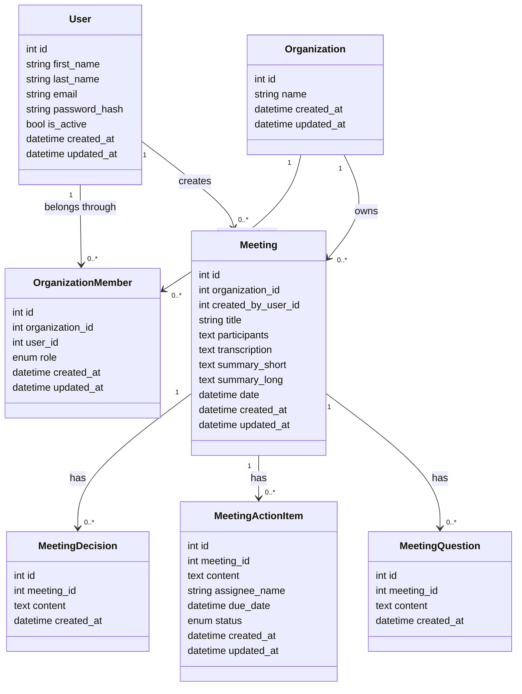

# RuinionAI - Architecture SaaS V1

Ce document sert de suivi pour le modele de donnees cible de la V1 SaaS.

## Regles V1

- Un utilisateur peut appartenir a une ou plusieurs organisations.
- Une organisation peut avoir plusieurs utilisateurs.
- Le role d'un utilisateur dans une organisation est stocke dans `organization_members`.
- Une reunion appartient toujours a une organisation.
- Une reunion garde aussi l'utilisateur qui l'a creee via `created_by_user_id`.
- Les participants d'une reunion restent un champ texte pour la V1.
- Les decisions, actions et questions peuvent etre ajoutees apres la base auth.

